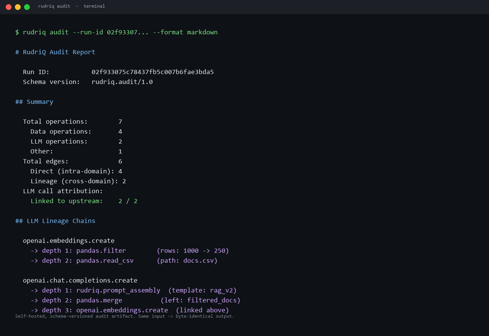

# RudriQ

> **Self-hosted, audit-grade evidence of why AI systems fail.**
>
> For regulated enterprises that cannot use cloud observability.

[](LICENSE)
[](https://www.python.org/)
[](https://github.com/kishanraj41/rudriq)
[](https://github.com/kishanraj41/rudriq)
[](https://papers.ssrn.com/sol3/papers.cfm?abstract_id=6683825)

When your AI system fails — drifts, hallucinates, returns the wrong answer — the cause is usually upstream of the LLM call. RudriQ traces failures back to the data pipeline operations that caused them, and produces audit-grade evidence designed for EU AI Act compliance, litigation defense, and AI liability insurance underwriting.



<sub>_Representative output. Lineage chains shown reflect the v0.0.6+ feature set with AutoLineage records mirrored into RudriQ storage; v0.0.5 today produces the same format with cross-domain edges to AutoLineage's tracker. See [BACKLOG.md](BACKLOG.md)._</sub>

## Why RudriQ

LLM observability tools tell you what happened at the LLM call. They are excellent at this.

RudriQ is different in two specific ways:

1. **Cross-domain trace.** We connect data operations (pandas, scikit-learn, RAG retrieval) to LLM calls (OpenAI, Anthropic) into a single causal chain. Existing observability tools start at the LLM call; we start before it.

2. **Self-hosted, no cloud dependencies.** RudriQ runs entirely inside your VPC. DuckDB by default, zero outbound network calls in core. Designed for buyers in healthcare, financial services, and government who cannot use cloud-deployed observability tools.

## Quickstart

```bash
pip install "rudriq[all]"
```

```python
import rudriq.auto    # one import: lineage tracking + LLM tracing + linker

# Your existing code runs unchanged.
import pandas as pd
docs = pd.read_csv('docs.csv')
docs = docs[docs['lang'] == 'en']

from openai import OpenAI
client = OpenAI()
embeddings = client.embeddings.create(
    model='text-embedding-3-small',
    input=docs['text'].tolist(),
)

# Generate the audit report — schema-versioned, deterministic.
from rudriq.export.audit import export_audit_markdown
print(export_audit_markdown(run_id))
```

Or from the CLI:

```bash
rudriq audit --run-id <id> --format markdown --output report.md
```

## What you get

A unified trace covering every data operation and every LLM call, with cross-domain causal links automatically attributed. Same data, two views — JSON for machine consumers, Markdown for an auditor reading the report directly.

```
Run ID:     abc-123
Schema:     rudriq.audit/1.0
Started:    2026-05-04T14:00:00+00:00
Total operations: 7  (data: 4, LLM: 2, other: 1)
LLM call attribution: 2/2 linked to upstream

LLM Lineage Chains
  openai.embeddings.create
    -> depth 1: pandas.filter        (rows: 1000 -> 250)
    -> depth 2: pandas.read_csv      (path: docs.csv)

  openai.chat.completions.create
    -> depth 1: rudriq.prompt_assembly  (template: rag_v2)
    -> depth 2: pandas.merge          (left: filtered_docs)
    -> depth 3: openai.embeddings.create  (linked above)
```

Every operation, every parameter, every cross-domain link, in your local DuckDB. Deterministic: same trace produces byte-identical JSON across calls and across DuckDB instances. See [docs/sample_audit_report.md](docs/sample_audit_report.md) for a real exporter output.

## Architecture

RudriQ is OpenTelemetry-compatible, not OpenTelemetry-bound. We use OTel for ingestion (so we get [OpenLLMetry](https://github.com/traceloop/openllmetry)'s SDK coverage for free) and for export (so we work with your existing observability stack), but our internal data model is a richer canonical schema with first-class causal edges, lineage links across domains, and audit metadata.

The cross-domain linker uses three matching strategies in order of confidence:

| Strategy | Confidence | Mechanism |
|---|---|---|
| Object identity | 1.0 | Python `id()` of LLM input matches a tracked AutoLineage output |
| Content hash | 0.8 | SHA-256 of input matches a recorded operation output |
| Name match | 0.5 | Heuristic correlation by variable/column name (v0.1) |

The first matching strategy wins. Match results are persisted as `LINEAGE_LINK` edges in the canonical TraceGraph and surfaced in audit reports. v0.0.4 added automatic registration so neither `register_object_identity` nor `record_llm_input` are visible in user code; the demo notebook is plain pandas + openai.

The data lineage substrate is **[AutoLineage](https://github.com/kishanraj41/autolineage)** (v0.5+), which captures pandas, scikit-learn, and PySpark operations and exposes a callback API that RudriQ wires into.

## Data handling and content capture

RudriQ is built for regulated environments. **By default, RudriQ does not store the content of your prompts, LLM responses, or source documents.** It captures operation metadata — shapes, timings, model names, token counts, lineage links — but not the text itself.

### Enabling content capture for evaluation

RudriQ's evaluation engine (groundedness, retrieval relevance) needs text content to compute semantic scores. To enable it, set:

```bash
export RUDRIQ_CAPTURE_CONTENT=true
```

When enabled:

- RudriQ stores **truncated previews** (default 500 characters, configurable via `RUDRIQ_PREVIEW_CHARS`, clamped to 50–10000) of prompts, responses, and document content.
- Previews are stored **only in your local DuckDB** (`~/.rudriq/traces.duckdb`). RudriQ Core makes no outbound network calls; content never leaves your environment.
- The flag is read at process start (RudriQ propagates it to OpenLLMetry's content capture and to the AutoLineage mirror callback). Toggling it does not retroactively redact previously captured runs.
- You can stop capturing at any time by unsetting the variable. Previously stored previews remain in the local database until you delete the run.

### For compliance teams

If your prompts or documents contain PII or PHI, evaluate whether content capture is appropriate for your environment. Recommended patterns:

- Run evaluation in non-production environments with synthetic data; keep capture disabled in production and rely on metadata-only tracing there.
- Use a short `RUDRIQ_PREVIEW_CHARS` limit (e.g. 100) to minimize stored content while keeping enough for semantic evaluation.
- Audit the captured previews directly in DuckDB before sharing exports with auditors:

  ```sql
  SELECT node_id, metadata FROM nodes
  WHERE json_extract(metadata, '$."rudriq.prompt_preview"') IS NOT NULL;
  ```

RudriQ's default-off posture means you opt into content storage deliberately, never by accident.

## Status: pre-alpha (v0.0.5)

Currently in active 30-day sprint development. v1.0 target: November 2026.

| Version | Target | Status |
|---|---|---|
| v0.0.5 | May 4, 2026 | ✅ Audit JSON + Markdown exporter (current) |
| v0.0.6 | May 11, 2026 | 🚧 AutoLineage record mirroring; production Traceloop flow verification |
| v0.2.0 | May 25, 2026 | ⏳ Evaluation engine + deviation-weighted root-cause analysis |
| v0.3.0 | Jun 1, 2026 | ⏳ PDF export + design partner outreach |
| v1.0.0 | Nov 2026 | ⏳ Air-gapped install, HIPAA BAA capable, SOC 2 Type II in progress |

See [BACKLOG.md](BACKLOG.md) for tracked deferrals.

## Run the demos

Two notebooks under [`examples/`](examples/) — one toy-scale, one production-shaped.

```bash
git clone https://github.com/kishanraj41/rudriq.git
cd rudriq
pip install -e ".[dev,llm,lineage]"
pytest tests/                                          # 95+ passing
jupyter notebook examples/rag_with_lineage.ipynb       # toy: 1 read, 1 filter, 1 LLM call
jupyter notebook examples/realistic_rag_pipeline.ipynb # realistic: 5 CSVs, ~200 ops, 43 LLM calls
```

The toy demo (`rag_with_lineage.ipynb`) is the four-cell intro that walks through the mechanism. The realistic demo (`realistic_rag_pipeline.ipynb`) runs an enterprise-shaped RAG pipeline — 5 source documents through ~200 pandas operations, 3 batched embedding calls and 20 query+chat cycles — and produces a complete audit report ready for compliance review. Both run offline (mocked OpenAI HTTP layer) and need no API keys.

### See it on a realistic workload

For design partner outreach and to evaluate RudriQ on something closer to your own workload, see [`examples/realistic_rag_pipeline.ipynb`](examples/realistic_rag_pipeline.ipynb). On v0.0.8 the retrieval-aware substring linker covers **23/43 LLM calls** — every batch embedding (object identity) and every chat completion (substring matching against tracked content embedded in the prompt). The 20 query embeddings remain unlinked by design: they're freshly-constructed strings with no upstream tracked source, and matching them on coincidental similarity would produce false positives that destroy the trust value of the audit report.

### Proof that drift detection works

[`examples/drift_demo.ipynb`](examples/drift_demo.ipynb) is the design-partner answer to "does drift actually work?" — a side-by-side contrast: baseline vs itself produces `drift_response = 1.000`, baseline vs the perturbed run (same prompts, rewritten responses) drops to `0.820` with real fastembed embeddings, and the new unmatched call is flagged as "new behavior." The notebook is honest about the magnitude — small sentence-embedding models cluster claim-style sentences tightly, so the drop reflects both the perturbation size and the embedding model's discriminating power.

### The one-scroll pitch

[`examples/design_partner_demo.ipynb`](examples/design_partner_demo.ipynb) walks a healthcare-AI ML lead through the whole story end-to-end in one scroll: realistic RAG pipeline → one-import capture → unified cross-domain trace (11/11 LLM calls linked in this run) → depth-11 lineage walk → five-evaluator quality scoring (all green) → ranked root-cause suspects with evidence → deterministic hashable audit report as Markdown/JSON/PDF. This is the artifact to screen-share on a first call.

## License

MIT. Use it however you want. Compliance buyers: a paid Enterprise tier with air-gapped install support, dedicated support, and certification path is in development for late 2026.

## Author

Built by [Kishan Raj VG](https://github.com/kishanraj41) at RudriQ Research, Austin, TX.

Author of [AutoLineage: Operation-Level Data Lineage for Python ML Pipelines via Import-Time Hooking](https://papers.ssrn.com/sol3/papers.cfm?abstract_id=6683825) (SSRN preprint, 2026), the data lineage substrate RudriQ builds on. JOSS reviewer.
